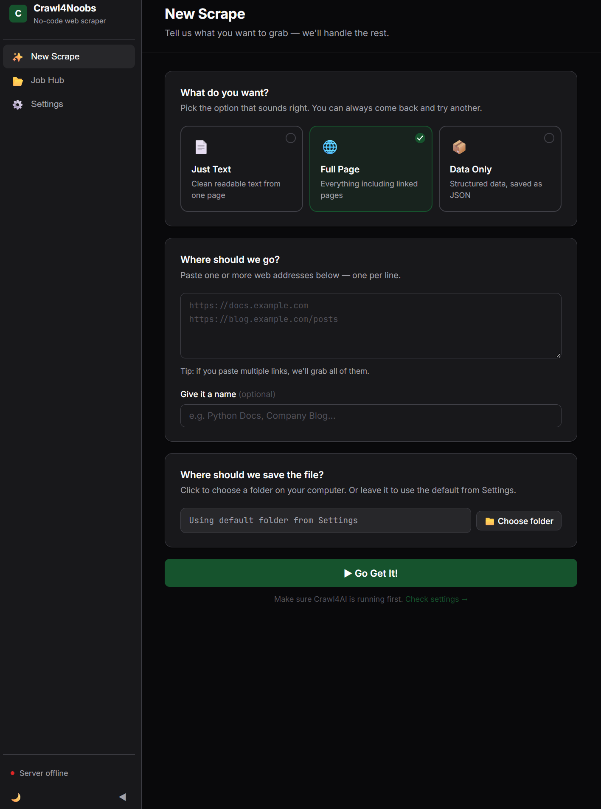
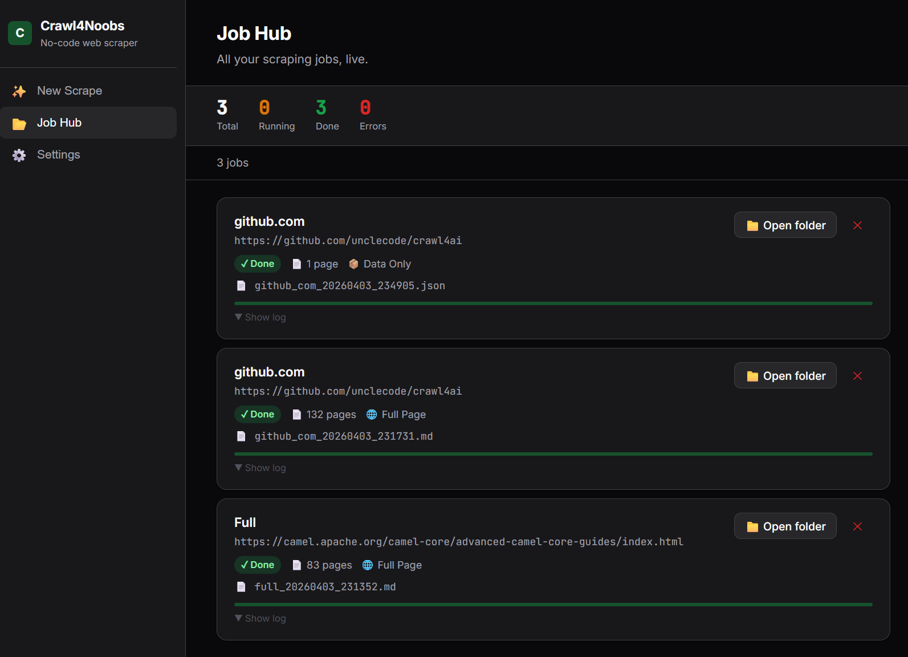

# Crawl4Noobs

A no-code GUI for [Crawl4AI](https://github.com/unclecode/crawl4ai) — for people who want to scrape websites without touching the command line.

| New Scrape | Job Hub |
|---|---|
|  |  |

---

## Getting started (2 steps)

**Step 1 — Start the engine** (one-time setup, needs [Docker](https://www.docker.com/products/docker-desktop/))

```bash
docker run -p 11235:11235 unclecode/crawl4ai:latest
```

**Step 2 — Open the app**

Double-click **`start.bat`** — installs requirements, starts the server, and opens your browser automatically.

> On Mac/Linux: `pip install flask aiohttp && python server.py`

That's it. No config files, no manual editing.

---

## What it does

- Point it at any website and it downloads the content as Markdown, JSON, HTML, or plain text
- Follow links automatically to scrape entire documentation sites or blogs
- Track all your scrapes in one place with live progress bars
- Everything is saved locally — no accounts, no cloud, no tracking

## Views

**New Scrape** — Pick a preset, paste URLs, choose a save folder, hit "Go Get It!". No jargon:
- **Just Text** — clean readable text from one page (Markdown)
- **Full Page** — follows links two levels deep, loads dynamic content
- **Data Only** — structured JSON, one page

**Job Hub** — Live dashboard showing all jobs. See pages scraped in real time, open the output folder when done, re-scrape any job with one click.

**Settings** — Set the Crawl4AI server URL and default save folder through the UI. No file editing needed.

## Python scripts (for power users)

The repo also includes ready-to-use Python scripts for common scraping patterns:

| Script | What it does |
|--------|-------------|
| `crawl_docs_recursive.py` | Recursively scrape a docs site. Resumes if interrupted. |
| `crawl_docs_multi_seed.py` | Scrape from multiple starting URLs, grouped by domain. |
| `crawl_multi_site.py` | Batch-scrape a list of sites, one output file each. |
| `crawl_blog.py` | Scrape all articles from a blog index page. |
| `crawl_blog_lightpanda.mjs` | Same as above but uses Lightpanda instead of Python. |

Each script has a config section at the top — edit the URLs and run it.

```bash
pip install aiohttp
python crawl_docs_recursive.py
```

## Crawl4AI

This repo includes Crawl4AI as a submodule (`crawl4ai/`). To pull it:

```bash
git submodule update --init
```

Full Crawl4AI docs: [crawl4ai.com](https://crawl4ai.com)
